Text-Popover is a MacOS menu bar app that pops up at user-specified intervals. These pop-ups contain user-specified texts, such as quotes or idioms, which are stored in databases in the [`text-popover-macOSDatabaseFiles/`](https://github.com/liweiyap/text-popover-macOS/tree/develop/text-popover-macOSDatabaseFiles) directory. Language learners could find this app especially useful, as they could use these pop-ups as virtual placards. The app is written in the [SwiftUI](https://developer.apple.com/documentation/swiftui/) framework.

| Light mode             |  Dark mode               |
:-----------------------:|:-------------------------:
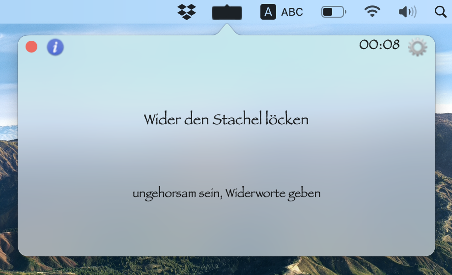 | 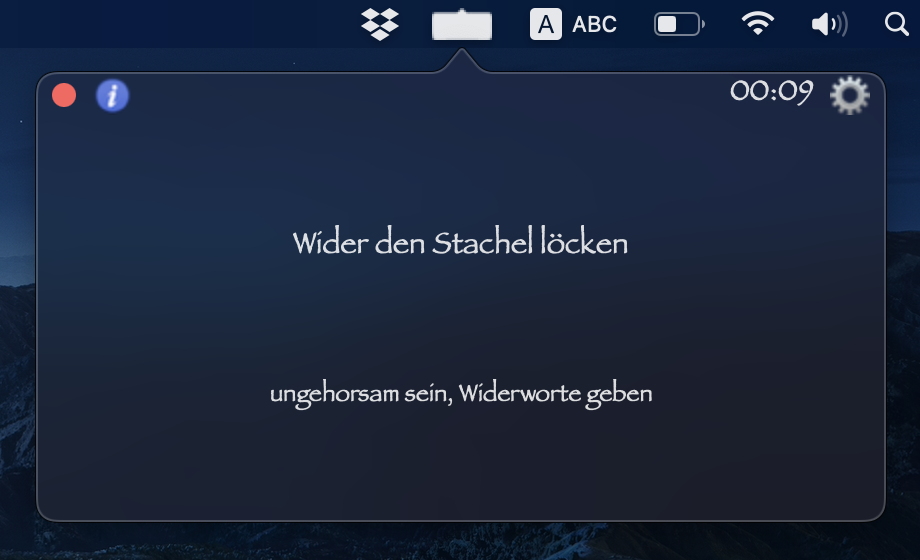

## Contents

* [Usage](#usage)
  * [Main page of popover](#main-page-of-popover)
  * [Next page of popover](#next-page-of-popover)
  * [Adjusting the settings](#adjusting-the-settings)
  * [Default database _"Redewendungen"_](#default-database-redewendungen)
  * [Adding a new database](#adding-a-new-database)
  * [Note on databases](#note-on-databases)
* [Installation](#installation)
  * [Requirements](#requirements)
  * [Instructions](#instructions)

## Usage

### Main page of popover

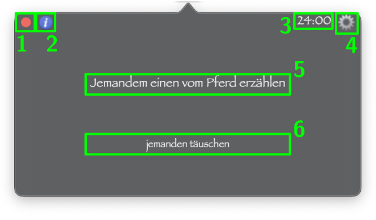

1. This button closes the app.
2. This button takes you to the [next page](#next-page-of-popover) of the popover, which shows any additional text that you might want to display.
3. This is the amount of time remaining before the text changes to the next available one in the current database.
4. This button opens the [settings window](#adjusting-the-settings).
5. This is the user-defined main text for display. In the image above, the main text (_Expression_) is a German idiom.
6. This is a user-defined sub-text for display. It can be blank. In the image, the sub-text (_Explanation_) is the meaning of the German idiom.

[_Back to top_](#contents)

### Next page of popover

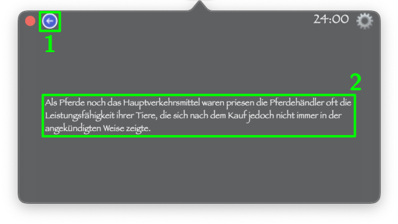

1. This button takes you back to the [main page](#main-page-of-popover) of the popover.
2. This is a user-defined sub-text (_Elaboration_) for display. It can be blank. In the image, the sub-text is the history behind the German idiom.

[_Back to top_](#contents)

### Adjusting the settings

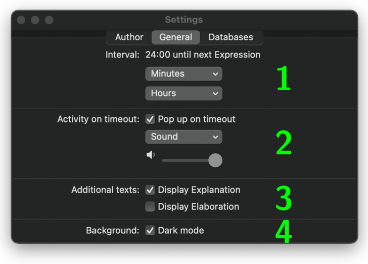

1. This segment sets the interval between changes in the text displayed in the popover. When the interval is up, the text is updated to the next available one in the current database, and the time is reset. The default interval is 24 hours.
2. This segment sets the sound played when the text in the popover is updated. By default, no sound is played. Drag on the slider to adjust the volume of the sound. By default, the sound is played at a maximal volume. In addition, by default, the popover appears automatically on the screen when the text gets updated. However, you have the option to turn off this pop-up behaviour, such that when the current interval is up, the text in the popover will still get updated but the popover will not appear on the screen.
3. This segment allows you to decide whether or not to display the sub-texts (_Explanation_ and _Elaboration_). After all, they could sometimes be blank. By default, the _Explanation_ is displayed but the _Elaboration_ (together with the blue button in the popover) is not.
4. This segment allows you to set the appearance of the popover to either light or dark mode. The default appearance is dark mode.

[_Back to top_](#contents)

### Default database _"Redewendungen"_

The default database contains German idioms (_Redewendungen_). Every time the app is restarted, the default database is automatically built from scratch. This is done by using the Python library [Beautiful Soup](https://pypi.org/project/beautifulsoup4/) to scrape the idioms, as well as their meaning and history, from [Wikipedia](https://de.wikipedia.org/wiki/Liste_deutscher_Redewendungen). Python is not required for any further databases that you may wish to add.

[_Back to top_](#contents)

### Adding a new database

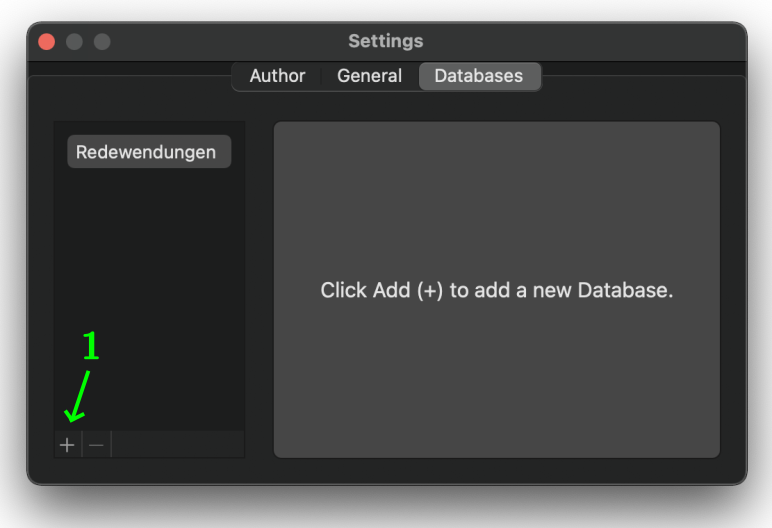

1. Click this button if you wish to add a new database.

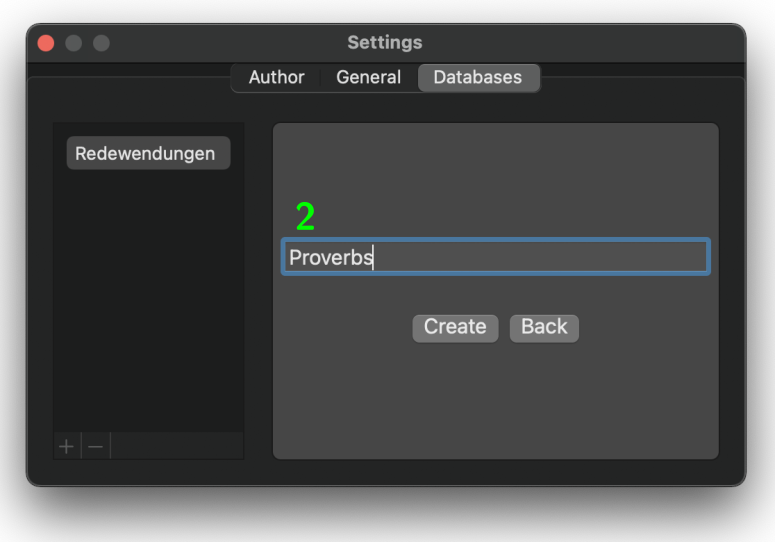

2. Input the name of your new database and click 'Create'.

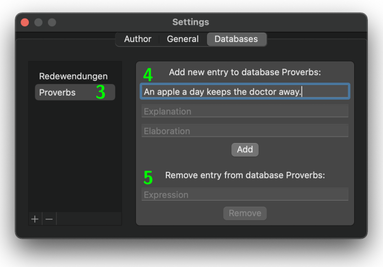

3. The list of databases on the left will automatically be updated. Click on the name of your new database.
4. Input as many entries as you like. The _Explanation_ and _Elaboration_ are optional but the _Expression_ cannot be left blank.
5. If you no longer want an entry, you can remove it from your database.

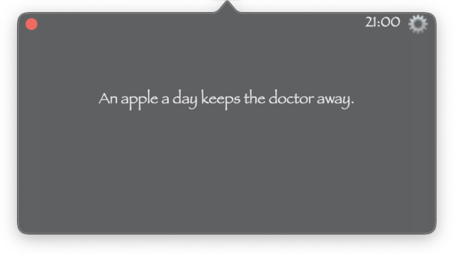

The popover will display entries from the new database as long as it is selected in the settings window.

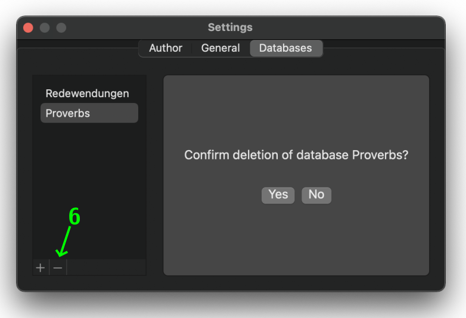

6. Click on this button if you no longer want a database, and then click 'Yes' to confirm deletion.

[_Back to top_](#contents)

### Note on databases

All databases are added to the [`text-popover-macOSDatabaseFiles/`](https://github.com/liweiyap/text-popover-macOS/tree/develop/text-popover-macOSDatabaseFiles) directory. From within the app, you cannot delete the default database _"Redewendungen"_. Neither can you add any new entries to the default database nor remove any entries from it. For more information, please refer to the [README](https://github.com/liweiyap/text-popover-macOS/blob/develop/text-popover-macOSDatabaseFiles/README.md) of that directory.

[_Back to top_](#contents)

## Installation

### Requirements

* [Xcode](https://apps.apple.com/gb/app/xcode/id497799835?mt=12) _(we used version 12.3)_
* [Carthage](https://github.com/Carthage/Carthage) _(can be downloaded using [Homebrew](https://brew.sh/))_
* Python 3 with [Beautiful Soup](https://pypi.org/project/beautifulsoup4/) _(we used version 4.9.1)_ installed

[_Back to top_](#contents)

### Instructions

1. Download the source code by clicking on the green 'Code' button on this website. Alternatively, clone the repository by first navigating to the path where you want to store the local copy and then running the following command in the Terminal:
   ```bash
   git clone https://github.com/liweiyap/text-popover-macOS.git
   ```
2. Install the [SQLite.swift](https://github.com/stephencelis/SQLite.swift) dependency using Carthage.
   * Navigate to the root directory of the repository and run the following command in the Terminal:
     ```bash
     carthage update --platform macOS
     ```
     This will produce a 'Carthage' folder in the root directory of the repository.
   * Navigate to 'Carthage > Checkouts > SQLite.swift' and open the file 'SQLite.xcodeproj' in Xcode.
   * [Set `Build Libraries for Distribution` to `Yes`](https://stackoverflow.com/questions/60162207/module-was-not-compiled-with-library-evolution-support-using-it-means-binary-co) and close the file 'SQLite.xcodeproj'.
   * Return to the root directory of the repository and run the following command in the Terminal:
     ```bash
     carthage build --platform macOS
     ```
   * Now, open the main file 'text-popover-macOS.xcodeproj' in Xcode.
   * In the 'General' settings tab of the 'text-popover-macOS' target, scroll down to the section 'Frameworks, Libraries, and Embedded Content'. Drag and drop the entire 'Carthage/Build/Mac/SQLite.framework' folder into this section.
3. Build and run the app in Xcode by clicking on the triangular icon at the top left corner of the screen.
   * If the following message box appears, click OK.
     
     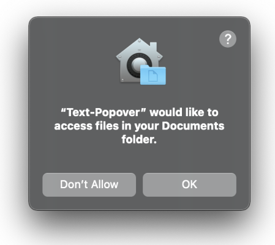
   * You might also need to open 'System Preferences > Security & Privacy > Privacy > Accessibility' and tick the check-box next to the 'Text-Popover' program.

[_Back to top_](#contents)
